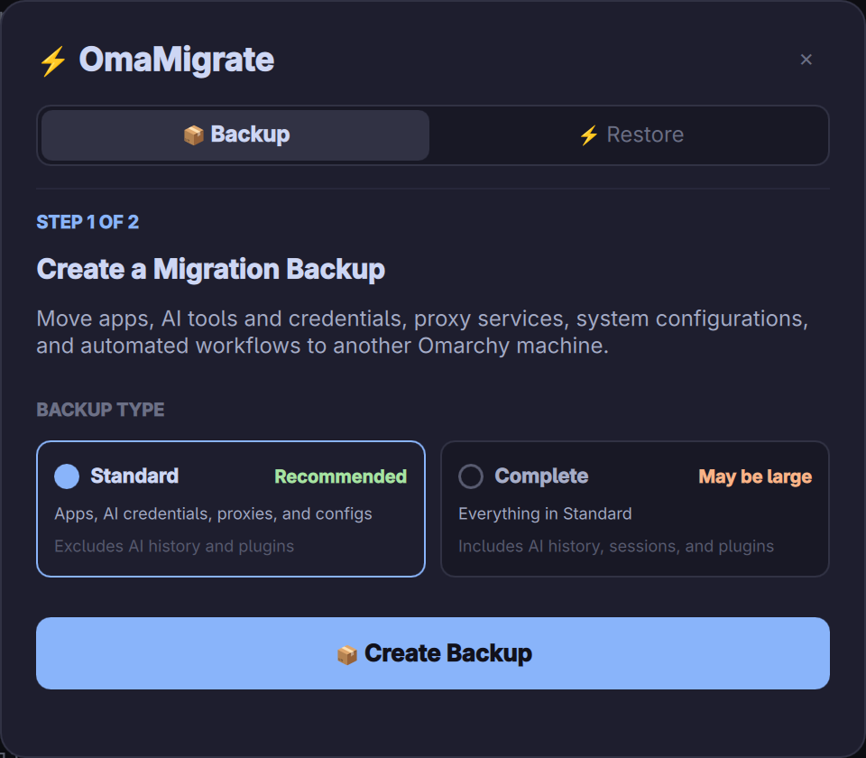

# OmaMigrate

[English](README.md) | **简体中文**

> OmaMigrate 可将已安装软件包清单、选定的用户配置、AI 凭据及可选会话历史、代理与系统服务配置和自动化工作流打包，并恢复到另一台 Omarchy 设备。

[](https://github.com/luneth90/omamigrate/actions/workflows/ci.yml)
[](https://github.com/luneth90/omamigrate/actions/workflows/codeql.yml)
[](https://scorecard.dev/viewer/?uri=github.com/luneth90/omamigrate)
[](https://github.com/luneth90/omamigrate/releases)
[](https://omarchy.org/)
[](#跨硬件架构智能兼容)
[](LICENSE)

> [!IMPORTANT]
> **无遥测、无云端服务、不会自动上传恢复包。** OmaMigrate 在本地创建迁移恢复包，绝不会将其内容发送到开发者控制的服务器。可选的 **打开 LocalSend** 操作只会把恢复包交给 LocalSend，通过本地网络直接传输给附近设备，并非上传云端。软件包管理器和已登录的工具仍可能发起其正常网络请求。

> [!WARNING]
> 迁移恢复包可能包含 SSH/GPG 密钥、AI 登录凭据、密码库和桌面密钥环。请将每个恢复包视为敏感文件：仅通过可信渠道传输、限制访问权限，并安全删除不再需要的副本。

<p align="center">
  
</p>

---

## 项目背景

传统的点对点配置同步工具（如基于 Git 的 UI 插件）通常只能同步基础的用户配置文件（`~/.config/hypr`）。当您拿到一台新电脑时，依然面临繁重的手动配置成本：
- 手动重新安装几十个 GUI 桌面软件与开发应用；
- 手动重新配置主流代理服务（**sing-box**、**Mihomo / Clash Verge**、**v2rayA**、**daed** 等）及定时器；
- 手动重新登录所有的 **AI 命令行工具**（Claude Code、OpenAI Codex、Antigravity `agy`、xAI Grok）；
- **邮件与定时自动化服务** 因缺少 GPG 密钥、`pass` 密码库或用户 systemd 定时器而无法工作；
- 新老电脑用户名不同（如从 `alice` 变成 `bob`）时，因配置中残留的绝对路径报错。

**OmaMigrate** 通过统一的跨架构迁移流程，帮助迁移选定的系统状态和用户数据：

```
[ 老电脑 (源机器) ]                                      [ 新电脑 (目标机器) ]
  ├── 显式应用清单 (自动过滤硬件驱动)                     ├── 差异化静默补齐安装 (yay/pacman)
  ├── 代理生态 (sing-box/Mihomo/Clash/v2rayA/daed) === LocalSend 局域网直传 ===> ├── 还原系统服务并自启定时器
  ├── 邮件客户端配置、GPG与pass密码库     迁移归档包 (tar)    ├── 还原 GPG 密钥与密码库
  ├── AI 凭据与 Session (Claude/Codex/Agy)                 ├── 恢复 AI 凭据与会话
  └── 桌面环境与终端配置                                  └── 自动纠偏用户名路径并热重载
```

---

## 核心技术特性

### 1. 跨硬件架构智能兼容 (ARM64 ↔ x86_64)
- 自动提取当前机器显式安装的应用清单（`pacman -Qqe`）。
- **智能硬件黑名单过滤**：自动剔除 Apple Silicon (Asahi Linux) 或特定机型的底层驱动与内核（如 `linux-asahi`, `m1n1`, `uboot`, `speakersafetyd`）。
- **效果**：在 **M 系列 Mac (aarch64)** 与 **Intel/AMD PC (x86_64)** 之间迁移时，会过滤已知的设备专用软件包；新机器再通过 `yay` 和 `pacman` 获取适合当前架构的二进制包，从而降低硬件相关的软件包冲突风险。

### 2. 全主流代理生态深度支持 (Multi-Proxy Ready)
无论使用系统级常驻守护进程还是 GUI 桌面客户端，OmaMigrate 都会备份受支持的配置，并在恢复后尝试重新启用相关服务：
- **系统核心服务 (Daemon & Transparent Proxy)**：
  - **sing-box**：自动备份还原 `/etc/sing-box/` 规则配置、安全组权限（`640 root:sing-box`）、自动轮换脚本及 `sing-box.service` / timer 定时器。
  - **Mihomo (原 Clash.Meta)**：完整备份 `/etc/mihomo/` 系统核心配置、`~/.config/mihomo/` 用户配置与 `mihomo.service`。
  - **v2rayA / Xray / v2ray**：完整备份 `/etc/v2raya/`、`/etc/xray/`、`/etc/v2ray/` 与对应后台服务并自启。
  - **daed / daed-next**：支持基于 eBPF 的高性能透明代理配置 `/etc/daed/` 与后台常驻服务。
- **桌面 GUI 代理客户端**：
  - **Clash Verge / Clash Verge Rev** (`~/.config/clash-verge`, `~/.config/clash-verge-rev`)
  - **Clash Nyanpasu** (`~/.config/clash-nyanpasu`)
  - **Mihomo Party** (`~/.config/mihomo-party`)
  - **Flclash** (`~/.config/flclash`)
  - **NekoBox / Nekoray / Matsuri** (`~/.config/nekoray`, `~/.config/Matsuri`)
  - 保留受支持的订阅节点、分流规则组、模式切换与本地缓存；当凭据和配置格式仍然有效时，客户端可继续使用原有配置。
- **终端与全局代理辅助**：
  - 自动备份与还原 **Proxychains-ng**（`~/.proxychains`、`/etc/proxychains.conf`）与终端代理函数。

### 3. 邮件客户端与定时自动化工作流迁移
- **主流邮件客户端配置迁移**：
  - **桌面客户端（Thunderbird 等）**：打包并还原 `~/.thunderbird/` 用户 Profile、账户配置、离线邮箱缓存与本地凭证环；兼容的配置可在新机继续使用，客户端仍可能要求重新认证。
  - **终端/CLI 客户端**：备份 `Himalaya`、`Aerc`、`Neomutt` 等命令行邮件客户端配置目录。
- **凭据与密钥库安全继承**：
  - 打包 **GPG 密钥库**（`~/.gnupg`）与 **Unix 密码管理器**（`~/.password-store`），用于恢复基于 `pass` 的凭据工作流。
- **自动化工作流与后台定时器**：
  - 自动保留 `~/.local/bin/` 里的邮件管理/分类/清理脚本（例如基于 `agy` 或各类模型的自动化工具）。
  - 自动注册并激活对应的 `systemd --user` 每日定时器。

### 4. AI 凭据、会话与系统 Keyring 迁移
- **Linux 桌面 Secret Service 密钥库完整同步**：
  - 自动备份与还原 **Linux 系统 Keyring** (`~/.local/share/keyrings/`)，完整包含 **Google Antigravity (`agy`)**、**VS Code**、**GitHub CLI** 与 Chrome 等应用在 Secret Service 中托管的 OAuth Token 与机密。
- **主流 AI 开发工具登录态与 Session 全量迁移**：
  - **Google Antigravity (`agy`)** (`~/.gemini/antigravity-cli/` 及系统 Keyring)
  - **OpenAI Codex** (`~/.codex/auth.json`, `~/.codex/config.toml`)
  - **Claude Code** (`~/.claude.json`, `~/.claude/`)
  - **xAI Grok** (`~/.grok/auth.json`)
  - **GitHub CLI (`gh`)** (`~/.config/gh/hosts.yml`)
- 当已保存的令牌仍然有效且恢复后的 Keyring 能够解锁时，受支持的工具可继续使用原登录状态；部分服务或应用仍可能要求重新认证。

> [!TIP]
> **最佳实践建议（系统登录密码）**：
> 强烈建议在新电脑上安装系统时，设置与老电脑**相同的用户登录密码**。
> - **原理解析**：Linux 桌面（SDDM/GDM 等）的 PAM 认证模块可在登录时使用系统密码解锁桌面 Keyring。新旧机器密码一致时，`agy`、VS Code、GitHub CLI 等工具更有可能直接复用恢复后的凭据，减少额外的解锁提示。
> - **若新电脑设置了不同密码**：首次启动 `agy` 或 VS Code 时，桌面会弹窗提示一次“输入密码以解锁登录密钥环”，输入老电脑的原密码即可解密；后续可通过系统密钥管理工具（如 `seahorse`）将密钥环密码同步为新密码。

### 5. 跨用户名绝对路径智能自适应
- 如果老机器用户名是 `alice`，新机器用户名是 `bob`，还原引擎会自动检测并批量将配置文件（`.codex`, `.claude.json`, `antigravity-cli`, `git/config`）中的硬编码旧路径动态替换为新主机的 `$HOME`。

### 6. 可重复执行、高容错的还原引擎
- **拦截 root 误触**：开头严格检测并拒绝以 `sudo` 运行，防止把家目录文件所有权污染为 `root:root`。
- **自动解 pacman 锁**：自动检测并清理因网络超时中断遗留的 `/var/lib/pacman/db.lck` 锁。
- **只读覆盖保护**：在覆盖前自动对家目录执行 `u+w` 赋权，降低 Git pack 只读文件导致 `Permission denied` 的概率。
- **可重复执行**：若因网络波动中断，可再次运行 `./restore.sh`，无需重新制作恢复包。

---

## 安装与桌面集成

### 1. 安装插件

在终端运行 Omarchy 官方插件管理指令，自动克隆并启用：

```bash
omarchy plugin add https://github.com/luneth90/omamigrate.git --enable
```

### 2. 绑定快捷键

在终端执行以下命令直接将快捷键追加到 `~/.config/hypr/bindings.lua`，并重启 shell 使快捷键立即生效（推荐 `SUPER + CTRL + M`，与 Omarchy 系统默认键位完美契合）：

```bash
echo 'o.bind("SUPER + CTRL + M", "OmaMigrate", "omarchy-shell shell toggle luneth90.omamigrate")' >> ~/.config/hypr/bindings.lua
omarchy restart shell
```

---

## 迁移使用流程 (Desktop Workflow)

### 场景一：通过可视化界面迁移（推荐）

按下 `SUPER + CTRL + M` 即可随时唤出 OmaMigrate 操作面板：

1. **📦 步骤一：创建迁移备份 (Backup)**
   - 点击界面第 1 个按钮，自动完成显式软件清单提取、硬件黑名单过滤、配置与凭证归档；
   - 选择 **Standard**（推荐）迁移应用、AI 凭据、代理服务及配置；选择 **Complete** 可额外包含 AI 对话历史、会话和插件，备份可能较大，具体取决于本地数据量；
   - 打包完成后在主目录生成 `~/omamigrate-backup.tar.gz`。
2. **📡 步骤二：本地设备直传**
   - 在 LocalSend 中打开恢复包，再选择附近的目标设备，通过局域网直接传输，不经过云端存储；接收设备通常会将文件保存到 `~/Downloads`。
3. **⚡ 步骤三：在新电脑还原 (Restore)**
   - 新电脑收到压缩包后，按下快捷键唤出 OmaMigrate 面板，点击第 3 个按钮即可安装可用的缺失软件包、还原受支持的凭据与配置、适配已知路径并重载桌面。

### 场景二：新电脑裸机还原（无需预装插件）

若新电脑是刚安装的纯净 Omarchy 系统，尚未安装 OmaMigrate 插件，也无需担心！压缩包内自带了**自包含的原生还原引擎**，开箱即可裸执行：

```bash
mkdir -p ~/omarchy-restore && tar -xzf ~/Downloads/omamigrate-backup.tar.gz -C ~/omarchy-restore
cd ~/omarchy-restore && ./restore.sh
```
*还原脚本会自动补齐缺失软件、恢复密钥凭据、重配网络服务并自适应配置路径。*

### 场景三：终端命令行调用（CLI 极客模式）

插件已内置了完整的 CLI 命令行接口，若您偏好在终端中纯命令行执行：

```bash
# 默认轻量打包（仅配置与凭证，推荐）
omamigrate backup [自定义输出路径.tar.gz]

# 包含全量 AI 聊天历史与插件，大小取决于本地数据量
omamigrate backup --with-ai-history [自定义输出路径.tar.gz]

# 在 LocalSend 中打开恢复包，通过局域网直接传输
omamigrate send [待发送压缩包路径]

# 从指定恢复包还原
omamigrate restore <归档包路径.tar.gz>
```

运行 `omamigrate --help` 可查看完整英文命令说明，或使用 `omamigrate <command> --help` 查看子命令选项。旧的 `export` 命令仍作为 `backup` 的兼容别名保留。

若希望在终端中直接使用 `omamigrate` 命令，可在 PATH 中创建软链接：

```bash
mkdir -p ~/.local/bin && ln -s ~/.config/omarchy/plugins/luneth90.omamigrate/bin/omamigrate ~/.local/bin/omamigrate
```

---

## 升级与维护

### 更新

```bash
omarchy plugin update luneth90.omamigrate --yes
```

如果界面没有自动刷新，可单独重启 Shell：

```bash
omarchy restart shell
```

### 卸载

```bash
omarchy plugin remove luneth90.omamigrate
```

如果此前创建了可选的 CLI 软链接，可单独清理该链接：

```bash
test ! -L ~/.local/bin/omamigrate || unlink ~/.local/bin/omamigrate
```

---

## 自动化测试

项目内置了自动化语法与执行完整性检查脚本：

```bash
./tests/test_syntax.sh
```

---

## 开源协议

基于 MIT License 开源 © 2026 OmaMigrate 项目组
